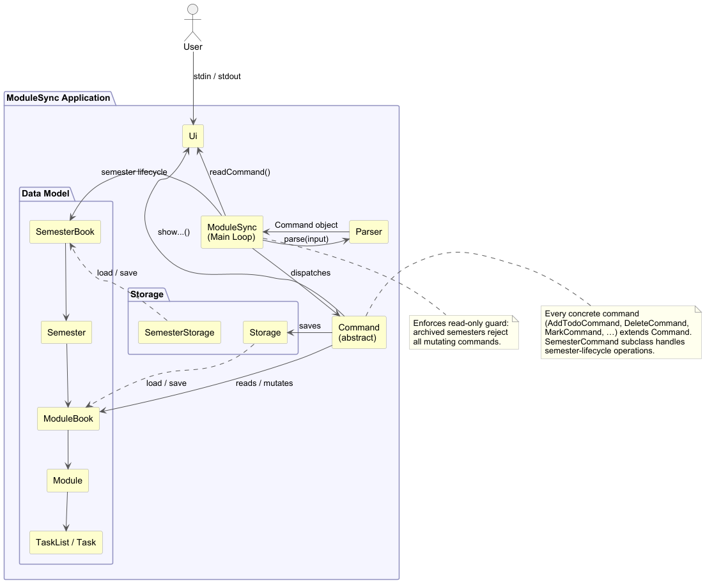
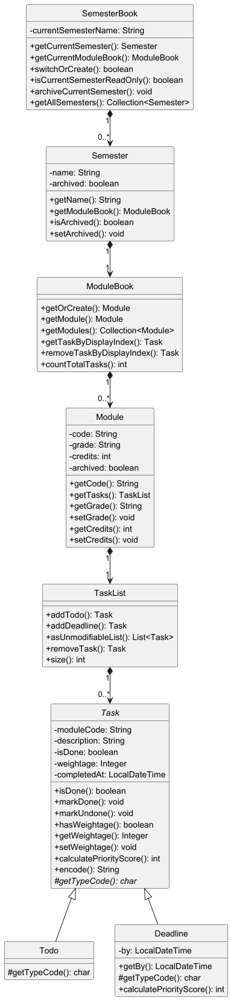
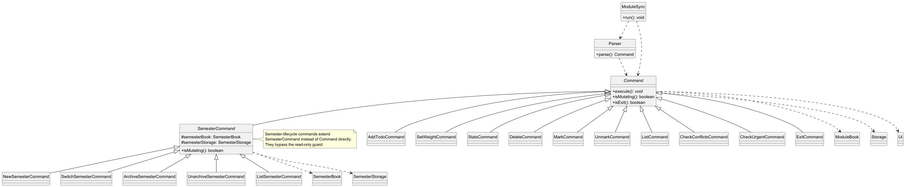
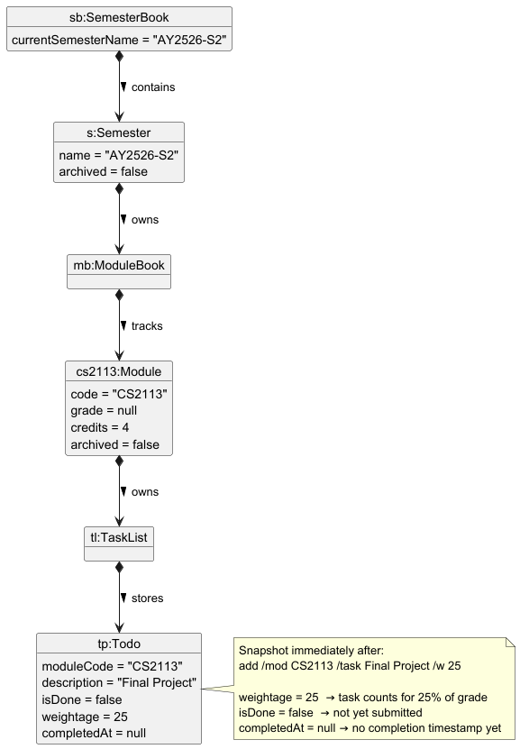
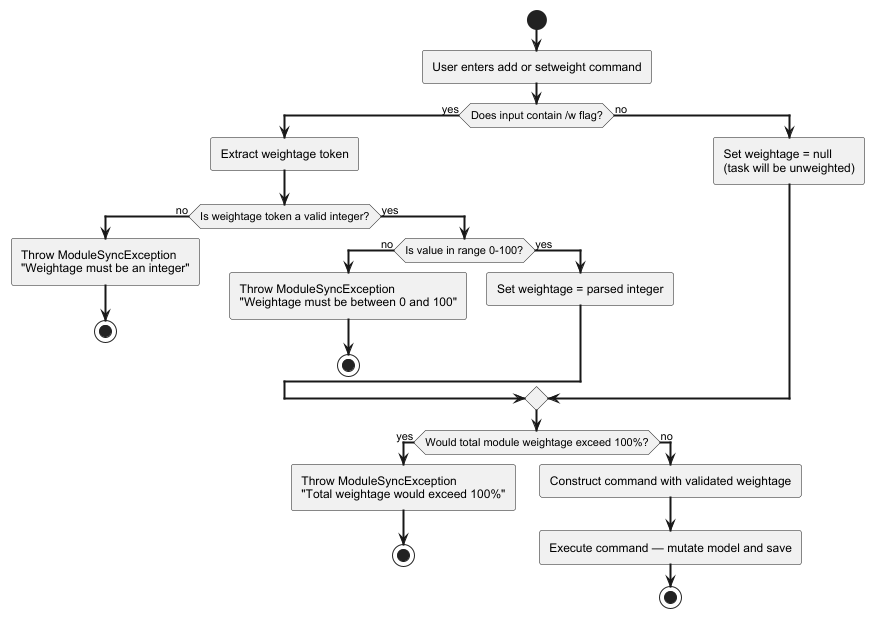
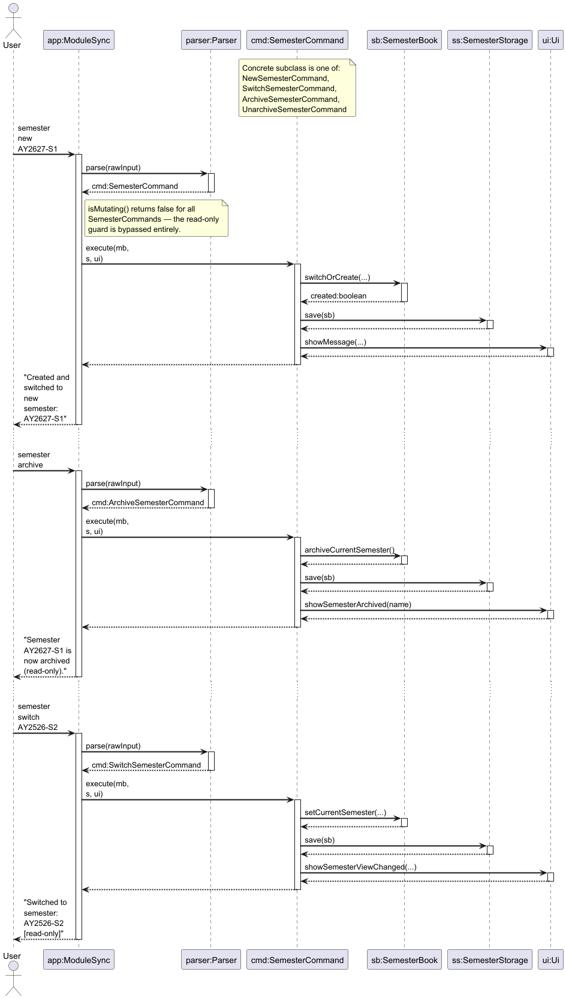

# Developer Guide

## Acknowledgements

* [CS2113 project template (AddressBook-Level 3)](https://github.com/se-edu/addressbook-level3) — project structure and Gradle build configuration
* [JUnit 5](https://junit.org/junit5/) — unit and integration testing framework
* [PlantUML](https://plantuml.com/) — UML diagram generation

---

## Design

### Architecture

ModuleSync is structured as a layered architecture with five major components. Each layer depends only on layers below it — no inner component imports from `Ui` or `Parser`.



> Generated from [`docs/diagrams/ArchitectureDiagram.puml`](diagrams/ArchitectureDiagram.puml)

### Component Responsibilities

**`Ui`** — The sole point of contact with the user. Reads `stdin` and writes `stdout`. Contains no business logic and knows nothing about the data model or file format.

**`Parser`** — Converts a raw input string into the correct concrete `Command` subclass. All syntax validation (flag presence, integer range checks, blank-string guards) happens here. Returns a fully constructed command or throws `ModuleSyncException` with a user-readable message.

**`Command` (abstract)** — Encapsulates a single user intent. Every subclass holds the parameters extracted by `Parser` and implements `execute(ModuleBook, Storage, Ui)`. Commands that do not modify any data override `isMutating()` to return `false`, allowing `ModuleSync` to enforce the read-only guard centrally without per-command duplication. A second abstract subclass, `SemesterCommand`, extends `Command` for commands that operate on semester lifecycle (switch, archive, list semesters) and are never blocked by the read-only guard.

**Data Model** — Pure in-memory state with no I/O. The full ownership hierarchy is:
`SemesterBook` → `Semester` → `ModuleBook` → `Module` → `TaskList` → `Task` (`Todo` | `Deadline`).

**`Storage` / `SemesterStorage`** — All file I/O is isolated here. `Storage` handles one per-semester task file. `SemesterStorage` manages the multi-semester directory layout and the `current.txt` pointer that records which semester is active. Neither class knows about commands.

### Data Model

The following class diagram shows the full ownership hierarchy of the application's data model and the key fields on each class:



> Generated from [`docs/diagrams/DataModelClassDiagram.puml`](diagrams/DataModelClassDiagram.puml)

Note that `Task` is abstract, with `Todo` and `Deadline` as the only concrete subclasses. The `weightage: Integer` field on `Task` is nullable — `null` means no weightage has been assigned, and any value from `0` to `100` is a valid percentage weight.

### Command Architecture

The following class diagram shows how all commands fit into the inheritance hierarchy and how `ModuleSync` and `Parser` relate to the abstract `Command` class:



> Generated from [`docs/diagrams/CommandArchitectureClassDiagram.puml`](diagrams/CommandArchitectureClassDiagram.puml)

The key design decision is that `Parser` creates and `ModuleSync` dispatches to the **abstract** `Command` type — neither depends on any concrete subclass. A developer adding a new feature therefore only needs to:
1. Create a class extending `Command` (or `SemesterCommand` for semester-level features).
2. Implement `execute()`.
3. Register the new keyword in `Parser`.

Nothing else in the codebase needs to change.

### Request Lifecycle

A typical mutating command (e.g. `add /mod CS2113 /task Final Project /w 25`) flows through the application as follows:

1. `Ui` reads the raw input string from `stdin`.
2. `Parser` parses the string and constructs the appropriate `Command` subclass.
3. `ModuleSync` calls `command.isMutating()`. If `true`, it also calls `semesterBook.isCurrentSemesterReadOnly()`. If the semester is archived, the command is rejected here — no per-command guard is needed.
4. `ModuleSync` retrieves the active semester's `ModuleBook` and a per-semester `Storage` instance, then calls `command.execute(activeModuleBook, activeSemesterStorage, ui)`.
5. The command mutates the data model, calls `storage.save(moduleBook)`, and calls the appropriate `ui.show...()` method.

Read-only commands (e.g. `stats /mod CS2113`, `list`) skip step 3 entirely and never call `storage.save()`.

---

## Implementation

> Each section below describes the design decisions behind a distinct feature area. All commands in
> this application follow the same Command Pattern established in the Architecture chapter —
> `Parser` constructs a fully validated command object; `ModuleSync` dispatches it; the command
> operates on the data model, persists any changes via `Storage`, and reports to `Ui`. Rather than
> repeating this dispatch flow in every section, each section focuses only on what is architecturally
> distinctive about that feature. Refer to the Command Architecture diagram and Request Lifecycle
> description in the Design chapter for the common structural baseline.

---

### Assigning and Managing Task Weightage

#### Overview

This feature allows students to associate a percentage-based weight with any task, reflecting its
contribution to the overall module grade. Weightage is entirely optional — tasks without it are
fully functional and display normally.

Two commands implement this feature:
- `add /mod CODE /task DESCRIPTION [/w PERCENT]` — creates a task with an optional weightage at creation time.
- `setweight TASK_NUMBER PERCENT` — assigns or updates the weightage of an existing task.

#### Where Weightage Lives in the Data Model

`weightage` is a field on the abstract `Task` class, typed as `Integer` (nullable). This decision
has three consequences a future developer must understand:

- **`null` means unweighted.** There is no separate `boolean isWeighted` flag. `hasWeightage()` is
  a convenience wrapper for `weightage != null`.
- **Each task carries its own weight independently.** There is no per-module weight table. This
  supports heterogeneous weightages (e.g. a 30% exam and a 10% quiz under the same module) without
  any coupling between tasks.
- **The sum across a module is not enforced.** A future feature that validates the 100% cap would
  need to add that logic to `Module` or `Parser` — the `Task` class itself has no such constraint.

The following object diagram shows the heap state immediately after
`add /mod CS2113 /task Final Project /w 25` executes, illustrating how the ownership chain from
the architecture maps to a concrete runtime state:



> Generated from [`docs/diagrams/WeightedTaskObjectDiagram.puml`](diagrams/WeightedTaskObjectDiagram.puml)

#### Execution Flow

The following sequence diagram illustrates the interactions when the user executes
`add /mod CS2113 /task Final Project /w 25`:


> Generated from [`docs/diagrams/AddWeightageSequenceDiagram.puml`](diagrams/AddWeightageSequenceDiagram.puml)

The `setweight` command follows the identical path — `Parser` → `SetWeightCommand` →
`ModuleBook.getTaskByDisplayIndex()` → `task.setWeightage()` → `Storage.save()` →
`Ui.showWeightSet()`. The only structural difference is that it retrieves an existing `Task` by
display index rather than creating a new one. A separate sequence diagram for `setweight` would be
a verbatim repeat and is therefore omitted.

#### Validation and Error Handling

All validation for weightage input is performed in `Parser` before any command object is
constructed. This keeps every command constructor free of user-facing validation logic — if an
`AddTodoCommand` or `SetWeightCommand` is ever instantiated, its parameters are already guaranteed
valid. The `assert` statements in the constructors document these guarantees for future developers.

The following activity diagram maps every decision point in the validation flow. It covers both
`add /w` and `setweight` since they share the same validation rules:



> Generated from [`docs/diagrams/WeightageValidationActivityDiagram.puml`](diagrams/WeightageValidationActivityDiagram.puml)

#### Design Considerations

**Aspect: Storing weightage as `Integer` (nullable) vs `int` + boolean flag**

* **Alternative 1 (current choice): `Integer weightage` — null means unweighted.**
    * Pros: Single field, single null-check. No risk of a two-field inconsistency.
    * Cons: Callers must handle `null`; less immediately obvious than a primitive to developers
      unfamiliar with the convention.

* **Alternative 2: `int weightage` + `boolean isWeighted`.**
    * Pros: Explicit intent; no null handling.
    * Cons: Two fields that must always be kept consistent. `isWeighted = true, weightage = 0` is
      technically valid but semantically ambiguous.

**Aspect: Where to validate the 0–100 range**

* **Alternative 1 (current choice): Validate in `Parser` at parse time.**
    * Pros: Invalid input is rejected before any object is constructed.
    * Cons: Validation rules in `Parser` must be kept in sync with the constraints on
      `Task.setWeightage()`.

* **Alternative 2: Validate inside `Task.setWeightage()`.**
    * Pros: Constraint is co-located with the field it guards.
    * Cons: `setWeightage` would need to throw a checked exception, which would propagate through
      the storage loading path — where a silent warning-log-and-skip is more appropriate.

**Aspect: Weightage field on `Task` vs. weightage map on `Module`**

* **Alternative 1 (current choice): Field on `Task`.**
    * Pros: Each task is self-contained. Trivially serialised per-task in the storage file.
    * Cons: A 100% cap constraint, if ever added, must be enforced at a higher level.

* **Alternative 2: `Map<Task, Integer>` on `Module`.**
    * Pros: Centralises weight management; a 100% cap is easy to enforce.
    * Cons: Complicates task removal and couples `Module` to task identity in a fragile way.

---

### Listing and Filtering Tasks

All `list` sub-commands (`list /deadlines`, `list /notdone`, `list /top`) follow the same Command
Pattern as every other command; the structural collaboration is captured in the Command Architecture
diagram. This section documents only the design decisions that are specific to each filter.

#### Listing Upcoming Deadlines (`list /deadlines`)

`Parser#parseList` detects the `/deadlines` flag and returns a `ListDeadlinesCommand`.
`Ui#showDeadlineList` collects all `Deadline` objects from the `ModuleBook`, groups them into three
urgency buckets — overdue, due today, and upcoming — and sorts each bucket chronologically before
concatenating the final output.

**Design Considerations**

**Aspect: Grouping vs. pure chronological sort**

* **Alternative 1 (current choice): Group by urgency bucket (upcoming → due today → overdue).**
  * Pros: Prevents stale overdue tasks from dominating the top of the list; surfaces near-term
    work first.
  * Cons: Slightly more sorting logic than a single comparator.

* **Alternative 2: Sort all deadlines strictly by due date ascending.**
  * Pros: Minimal implementation complexity.
  * Cons: Very old overdue tasks can bury near-term upcoming work.

#### Listing Incomplete Tasks by Module (`list /notdone /mod MOD`)

`Parser#parseList` detects both `/notdone` and `/mod` flags together and returns a
`ListNotDoneCommand`. `Ui#showNotDoneTaskList` traverses all modules but prints only incomplete
tasks belonging to the target module, preserving the **global display indices** shown by `list`.
This allows the user to immediately follow up with `mark`, `unmark`, or `delete` using the indices
they see.

The parser requires both flags together — `list /notdone` without a module code is rejected, as
is `list /notdone /mod` without a value.

**Design Considerations**

**Aspect: Where to implement the not-done filtering**

* **Alternative 1 (current choice): Filter in `Ui#showNotDoneTaskList`.**
  * Pros: View-only feature; no changes to model classes or persistence.
  * Cons: Traversal and filtering logic resides in the UI layer.

* **Alternative 2: Filter in `ModuleBook` or `TaskList`, returning a structured result.**
  * Pros: More reusable across future commands.
  * Cons: Requires a strategy for preserving global indices in the filtered result.

**Aspect: Index preservation vs. renumbering**

* **Alternative 1 (current choice): Preserve global indices from `list`.**
  * Pros: Users can chain follow-up commands without re-running `list`.
  * Cons: Indices appear sparse in a filtered view.

* **Alternative 2: Renumber from 1.**
  * Pros: The filtered list looks compact.
  * Cons: Requires separate identifiers or an extra `list` run before any follow-up command.

#### Deleting a Task (`delete TASK_NUMBER`)

`Parser#parseDelete` extracts the 1-based display index and returns a `DeleteCommand`.
`DeleteCommand#execute` calls `ModuleBook#removeTaskByDisplayIndex`, which performs a global scan
across all modules to convert the display index to a per-module position and removes the task.
The updated `ModuleBook` is then persisted via `Storage#save`.

The sequence diagram below illustrates these interactions:


> Generated from [`docs/diagrams/DeleteTaskSequenceDiagram.puml`](diagrams/DeleteTaskSequenceDiagram.puml)

**Design Considerations**

**Aspect: Global index vs. module-scoped index**

* **Alternative 1 (current choice): Use the global display index shown by `list`.**
  * Pros: Consistent with `mark` and `unmark`; single parameter for the user.
  * Cons: Index depends on the current global ordering across all modules.

* **Alternative 2: Module-scoped index (e.g. `delete /mod CS2113 2`).**
  * Pros: Stable within a module.
  * Cons: Requires the user to supply both a module code and an index.

**Aspect: Where to validate the index**

* **Alternative 1 (current choice): Parse the integer in `Parser`; validate existence in `ModuleBook`.**
  * Pros: Clean separation — syntax validation in `Parser`, semantic validation in the model.
  * Cons: Error messages may originate from different layers.

* **Alternative 2: Validate entirely inside `DeleteCommand#execute`.**
  * Pros: Delete-related logic concentrated in one place.
  * Cons: Commands begin duplicating model-level checks.

---

### Viewing Module and Semester Statistics

Both the per-module `stats /mod` command and the semester-wide `semester stats` command are
view-only: they iterate over the `ModuleBook`, aggregate counts and percentages from in-memory
data, and print the result. Neither persists anything to disk.

The structural collaboration for `semester stats` — including the nested loops over `Module`,
`TaskList`, and `Task` — is shown in the sequence diagram below:


> Generated from [`docs/diagrams/SemesterStatsSequenceDiagram.puml`](diagrams/SemesterStatsSequenceDiagram.puml)

**Design Considerations**

**Aspect: Where to compute statistics**

* **Alternative 1 (current choice): Compute inside `Ui#showSemesterStatistics`.**
  * Pros: Feature remains view-only; no changes to model classes.
  * Cons: Aggregation logic lives in the UI layer and is less reusable.

* **Alternative 2: Compute in a dedicated service class (e.g. `SemesterStats`).**
  * Pros: Easier to unit-test and extend.
  * Cons: Adds an extra class for a relatively small computation.

**Aspect: Weightage-based completion**

* **Alternative 1 (current choice): Treat weightage as optional; compute the weighted metric only
  when at least one task in the semester has a weightage assigned.**
  * Pros: Works correctly for both weighted and unweighted task sets.
  * Cons: The weighted completion line is absent until the user starts assigning weightage.

---

### Calculating CAP (`cap` and `setcredits`)

`CapCommand` iterates over the `ModuleBook`, maps each module's letter grade to its grade point on
the NUS 5.0 scale, and computes a weighted average using the module's stored MCs. Modules that are
ungraded, or that carry non-CAP-bearing grades (`CS`, `CU`, `S`, `U`), are excluded from the
calculation. Zero-credit modules are also excluded to avoid division-by-zero artefacts.

`setcredits` enforces an MC range of 0–40 per module, matching standard NUS module credit values.
If the total credits across all modules in the current semester exceed 32, `Ui#showHighSemesterCreditsWarning`
is triggered to alert the user to an unusually heavy workload.

**Design Considerations**

**Aspect: On-the-fly calculation vs. caching**

* **Alternative 1 (current choice): Compute CAP on-the-fly during `CapCommand#execute`.**
  * Pros: Always reflects the latest grades and credits; no risk of a stale cached value.
  * Cons: Iterates the module list on every invocation.

* **Alternative 2: Cache CAP inside `ModuleBook`.**
  * Pros: O(1) retrieval for subsequent calls.
  * Cons: The cache must be invalidated on every grade or credit change — a fragile invariant to
    maintain across multiple command types.

---

### Checking Deadline Conflicts and Urgency

Two commands surface deadline-proximity information without modifying any data:

* `check /conflicts` — groups all `Deadline` tasks by calendar date and reports any date on which
  two or more deadlines fall simultaneously.
* `check /urgent` — filters for incomplete `Deadline` tasks whose due date falls within 48 hours of
  the current system time (`LocalDateTime.now()`), then sorts the results by proximity so the most
  imminent task appears first.

Both commands operate entirely on in-memory data and follow the standard Command Pattern.

**Design Considerations for `check /urgent`**

**Aspect: Static 48-hour window vs. dynamic background tagging**

* **Alternative 1 (current choice): Evaluate the window dynamically at command execution time.**
  * Pros: Stateless; always uses the accurate current time; no threading complexity.
  * Cons: Requires iterating the task list on each invocation.

* **Alternative 2: A background thread that continuously tags tasks as urgent.**
  * Pros: The UI could surface urgent tasks passively, without a dedicated command.
  * Cons: Introduces multi-threading into a single-user CLI application — significant complexity
    for negligible practical benefit.

---

### Applying Defensive Programming and Logging

`assert` statements are placed throughout command constructors and critical model operations (e.g.
`DeleteCommand`, `ModuleBook#removeTaskByDisplayIndex`) to document preconditions and invariants.
These assertions are enabled at runtime during development and testing via the Gradle configuration.

All application-level log records are written exclusively to `modulesync.log` using
`java.util.logging.FileHandler`. The JUL root logger's default `ConsoleHandler` is removed at
startup in `ModuleSync#configureLogging()` so that no log output ever appears in the user's
terminal.

**Design Considerations**

**Aspect: Log destination**

* **Alternative 1 (current choice): Write to `modulesync.log` via `FileHandler`.**
  * Pros: Keeps the terminal output clean; diagnostic records are still available for
    post-hoc investigation.
  * Cons: Developers must open the log file separately to inspect records.

* **Alternative 2: Log to `stderr` (the JUL default).**
  * Pros: Records are immediately visible during development.
  * Cons: Log records pollute the user-facing terminal, which is unacceptable for a CLI product.

---

### Managing Module Lifecycles (`add /mod` and `delete module /mod`)

A `Module` in ModuleSync is created lazily: the first `add /mod MOD /task ...` command for a
previously unseen module code calls `ModuleBook#getOrCreate(code)`, which inserts a new `Module`
entry if one does not already exist. This means no explicit "register module" step is required.
Duplicate codes are silently deduped by the `LinkedHashMap` backing `ModuleBook`.

`delete module /mod MOD` calls `ModuleBook#deleteModule(code)`, which removes the `Module` and all
its tasks from the map. The deletion is persisted immediately via `Storage#save`.

**Design Considerations**

**Aspect: Lazy creation vs. explicit registration**

* **Alternative 1 (current choice): Create modules implicitly on first `add`.**
  * Pros: No additional command or workflow step; consistent with how the CLI is naturally used.
  * Cons: An empty module cannot exist — a module only appears after its first task is added.

* **Alternative 2: Explicit `module add MOD` command.**
  * Pros: Allows empty modules; makes module existence an explicit user action.
  * Cons: Adds a required step before any task can be added, increasing friction.

---

### Managing the Semester Lifecycle

The semester lifecycle encompasses four operations, each handled by a dedicated
`SemesterCommand` subclass:

| Command | Class | `SemesterBook` method |
|---|---|---|
| `semester new NAME` | `NewSemesterCommand` | `switchOrCreate(name)` |
| `semester switch NAME` | `SwitchSemesterCommand` | `setCurrentSemester(name)` |
| `semester archive` | `ArchiveSemesterCommand` | `archiveCurrentSemester()` |
| `semester unarchive` | `UnarchiveSemesterCommand` | `unarchiveCurrentSemester()` |

All four commands extend `SemesterCommand` rather than `Command` directly. `SemesterCommand`
overrides `isMutating()` to return `false`, which causes `ModuleSync#run()` to bypass the
read-only guard entirely. This is intentional: semester-lifecycle operations must be executable
regardless of the archived state of the current semester (e.g. a user must be able to
`semester archive` their semester, or `semester switch` away from it, even when it is already
read-only).

After each lifecycle change, the command calls `SemesterStorage#save(semesterBook)`, which
rewrites every semester's `.txt` file and updates `data/current.txt` to point at the new active
semester.

The following sequence diagram illustrates the three most common lifecycle transitions —
creation, archiving, and switching — in a single run:



> Generated from [`docs/diagrams/SemesterLifecycleSequenceDiagram.puml`](diagrams/SemesterLifecycleSequenceDiagram.puml)

**Design Considerations**

**Aspect: Why `SemesterCommand` bypasses the read-only guard**

* **Alternative 1 (current choice): `SemesterCommand#isMutating()` always returns `false`.**
  * Pros: Semester-lifecycle commands can always execute; the user is never locked out of
    managing semesters even in an archived context.
  * Cons: A developer must understand that `isMutating() == false` does not mean the command is
    side-effect free for `SemesterCommand` subclasses — it only means the guard is bypassed.

* **Alternative 2: Introduce a separate `bypassesGuard()` method.**
  * Pros: Makes the bypass intent explicit and distinct from the "truly read-only" case.
  * Cons: Adds API surface to the `Command` hierarchy for a narrow use case.

**Aspect: `semester new` dual behaviour (create or switch)**

* **Alternative 1 (current choice): `semester new` creates a semester if it does not exist, or
  switches to it silently if it does.**
  * Pros: Idempotent; users can re-issue the command without error.
  * Cons: The command name implies creation, which may be surprising when it silently switches.

* **Alternative 2: Separate `semester new` and `semester switch` strictly — `semester new`
  fails if the semester already exists.**
  * Pros: Clearer intent mapping.
  * Cons: Forces users to remember which semester names already exist before using the command.

---

### [Feature] Ranking Tasks by Priority (`list /top`)

#### Overview

The priority ranking feature allows users to surface their most urgent work with `list /top N`.
Each task carries a **priority score** — a single integer displayed as `[Priority: N]` — computed
from two inputs: the task's weightage and, for deadline tasks, how soon the deadline falls.

#### Priority Score Formula

**For `Todo` tasks (no deadline):**

```
priority = weightage          (0 if no weightage is set)
```

**For `Deadline` tasks:**

```
priority = weightage + urgencyScore

urgencyScore = (elapsedDays × URGENCY_SCALE) + MINIMUM_DEADLINE_URGENCY_SCORE
```

Where:
- `elapsedDays` = number of days already consumed within a 30-day urgency window
  (i.e. `30 − daysUntilDeadline`, clamped to 0–30)
- `URGENCY_SCALE = 6` — each day of additional urgency is worth 6 priority points
- `MINIMUM_DEADLINE_URGENCY_SCORE = 1` — every deadline task receives at least 1 urgency point
- If the deadline has already passed, `urgencyScore` is capped at `MAX = 31 × 6 = 186`

**Score ranges:**

| Condition | Urgency contribution |
|---|---|
| Overdue (deadline passed) | 186 |
| Due today | 181 |
| Due in 7 days | 181 − (7 × 6) = 139 |
| Due in 30+ days | 1 |
| Todo (no deadline) | 0 |

Because the urgency range (1–186) substantially exceeds the weightage range (0–100), **deadline
proximity is the primary ranking driver**. A lower-weighted task due today will outscore a
higher-weighted task due in one week if the weightage gap is smaller than the urgency difference
(e.g. a 10% task due today scores `10 + 181 = 191`; a 50% task due in 7 days scores
`50 + 139 = 189`).

#### Design Considerations

**Aspect: Urgency scale factor**

* **Alternative 1 (Current choice): `URGENCY_SCALE = 6`, additive formula.**
  * Pros: Deadline proximity dominates for imminent tasks while weightage still acts as a
    meaningful tiebreaker for tasks with similar deadlines. Single constant to tune.
  * Cons: The interaction between the two components is not immediately intuitive from the
    displayed number alone.

* **Alternative 2: Multiplicative formula (`weightage × urgency`).**
  * Pros: Completely eliminates tasks with zero weightage from the top of the list.
  * Cons: Unweighted tasks always score 0 regardless of urgency; requires rewriting the
    base class method.

**Aspect: Urgency window (30 days)**

* **Alternative 1 (Current choice): Tasks due beyond 30 days receive minimum urgency (1).**
  * Pros: Keeps the score bounded and focuses attention on the near term.
  * Cons: All tasks due in ≥ 30 days look identical in urgency contribution.

* **Alternative 2: Continuous decay over a longer window (e.g. 90 days).**
  * Pros: Fine-grained urgency even for distant deadlines.
  * Cons: Scores become harder to reason about; distant tasks gain undue urgency weight.

---

## Product scope

### Target user profile

ModuleSync targets **NUS undergraduate students** who are simultaneously managing coursework across four to six modules, an internship search, and co-curricular commitments. More specifically, the target user:

* is **comfortable using a terminal** and prefers typed commands over graphical interfaces
* types faster than they click, and finds GUI task managers slow and distracting
* organises work **by module code** (CS2113, MA1521, etc.) as their primary mental model
* needs to track both simple to-do tasks and deadline tasks with exact due dates and times
* wants to record **percentage weightages** against assessments so priority is reflected in their task list
* wants to review **grades and CAP progress** across semesters without switching to a separate tool
* may need to **reference past semesters** without accidentally editing closed academic records

### Value proposition

ModuleSync solves the problem of context-switching overhead for students who currently spread task tracking across multiple tools — a notes app for todos, a calendar for deadlines, a spreadsheet for grades. ModuleSync consolidates all three into one keyboard-driven CLI:

* **One-shot task creation** — a single `add` command records a task under its module, optionally with a deadline and a weightage percentage. No multi-step wizard, no mouse required.
* **Module-centric organisation** — tasks are grouped by module code, mirroring how a student's semester actually works rather than imposing an arbitrary folder structure.
* **Deadline intelligence** — automatic overdue warnings on startup, same-day conflict detection (`check /conflicts`), and 48-hour urgency filtering (`check /urgent`) surface crunch periods before they arrive.
* **Grade and CAP tracking** — recording a grade against a module immediately feeds into semester and cumulative CAP calculations. No separate spreadsheet needed.
* **Multi-semester history** — past semesters are archived in read-only mode, letting students safely reference old tasks and grades without the risk of accidental edits.
* **Human-readable storage** — data files are plain UTF-8 text. A student can read, back up, or migrate their data without any proprietary tools.

---

## User Stories

| Version | As a … | I want to … | So that I can … |
|---------|--------|-------------|-----------------|
| v1.0 | new user | see a list of all available commands | learn how to use the application without reading external documentation |
| v1.0 | student | add a task under a module code | organise my work by module the way I already think about it |
| v1.0 | student | mark a task as done | keep track of what I have finished |
| v1.0 | student | unmark a task | correct a mistake or reopen work I thought was complete |
| v1.0 | student | delete a task | remove tasks that are no longer relevant |
| v1.0 | student | list all my tasks | get an overview of everything I still need to do |
| v2.0 | student | add a deadline to a task with an exact date and time | know precisely when each assessment is due |
| v2.0 | student | assign a weightage percentage to a task | see at a glance which assessments matter most to my grade |
| v2.0 | student | update the weightage of an existing task | correct a percentage I entered wrongly without deleting and recreating the task |
| v2.0 | student | update the deadline of an existing task | correct a date I entered wrongly without deleting and recreating the task |
| v2.0 | student | see only unfinished tasks for a specific module | focus on remaining work without wading through completed items |
| v2.0 | student | view all deadlines sorted by due date | plan the next few weeks at a glance |
| v2.0 | student | view my highest-priority tasks by priority score | focus on what is most urgent and most heavily weighted |
| v2.0 | student | be warned about overdue tasks when I open the app | react immediately to anything I have missed |
| v2.0 | student | check which days have multiple deadlines falling at the same time | plan ahead and avoid last-minute crunch |
| v2.0 | student | check tasks due within the next 48 hours | focus on what is most immediately urgent |
| v2.0 | student | view per-module completion statistics including on-time and late rates | reflect on my work habits for a specific module |
| v2.0 | student | view a semester-wide task summary | understand my overall workload and progress at a glance |
| v2.0 | student | record a final grade for a module | keep all academic records in one place |
| v2.0 | student | view my current semester CAP and cumulative CAP | track my academic standing without opening a separate spreadsheet |
| v2.0 | student | view my full grade history across all semesters | understand how my performance has evolved over time |
| v2.0 | student | archive a module so it disappears from my main task list | reduce clutter once a module is fully completed |
| v2.0 | student | restore an archived module | access its tasks again if I archived it by mistake |
| v2.0 | student | create a new semester and switch to it | start a fresh task list without losing previous data |
| v2.0 | student | switch to a past semester in read-only mode | safely reference old tasks and grades without risking accidental edits |
| v2.0 | student | archive my current semester | transition to a new term while finalizing my academic records |
| v2.0 | student | see which semester I am currently working in on startup | immediately know whether I am in the right context |

## Non-Functional Requirements

1. **Java version** — ModuleSync requires Java 17 or above. It must run on any operating system that provides a compatible JVM (Windows, macOS, Linux).
2. **No network dependency** — ModuleSync is a fully offline, single-user application. It must function without any internet connection.
3. **Response time** — All commands must respond within one second on a machine with at least 4 GB of RAM and a modern dual-core processor, for a dataset of up to 500 tasks across 10 semesters.
4. **Data durability** — Every mutating command saves immediately to the relevant semester file before returning control to the user. A crash after a successful save must not cause data loss for that command.
5. **Human-readable storage** — Data files must be plain UTF-8 text that a user can open and understand in any text editor without special tooling.
6. **Single-user** — ModuleSync is designed for use by one person on one machine. Concurrent access to the same data directory by multiple processes is not supported and not required.
7. **No GUI dependency** — The application must operate entirely through a terminal. No graphical display system (e.g. a desktop environment) is required.
8. **Portability** — Transferring the `data/` folder to another machine running the same Java version must fully restore all semesters, tasks, and grades without any conversion step.

---

## Glossary

| Term | Definition |
|------|-----------|
| **Module** | An academic course identified by a module code (e.g. `CS2113`). In ModuleSync, a module is created automatically the first time a task is added under its code. |
| **Task** | A unit of work belonging to a module. A task is either a **Todo** (no due date) or a **Deadline** (has a due date and time). |
| **Weightage** | An integer from `0` to `100` representing a task's percentage contribution to the module's overall grade. Weightage is optional — tasks without it are still fully functional. |
| **Semester** | A named academic period (e.g. `AY2526-S2`) that groups a set of modules and their tasks. Each semester is stored in its own file under `data/`. |
| **Active semester** | The semester the user is currently working in. All mutating commands (`add`, `delete`, `mark`, etc.) operate on the active semester's `ModuleBook`. |
| **Archived semester** | A semester that has been closed and marked read-only (via `semester archive`). View commands (`list`, `cap`, `grades list`, `semester stats`) still work; mutating commands are rejected. It can be made editable again via `semester unarchive`. |
| **Archived module** | A module within the active semester that has been hidden from the main `list` and `list /deadlines` views. It remains visible in `module list` and can be restored with `module unarchive`. |
| **Display index** | The 1-based integer shown next to each task by the `list` command. Used as the identifier for `mark`, `unmark`, `delete`, `setweight`, and `setdeadline`. |
| **CAP** | Cumulative Average Point — NUS's GPA metric on a 5.0 scale. Only CAP-bearing grades (`A+`, `A`, `A-`, `B+`, etc.) contribute. Grades such as `S`, `U`, `CS`, and `CU` are excluded. |
| **MCs** | Modular Credits — the credit-unit weight of a module. Used as the denominator when computing weighted CAP averages. |
| **Priority score** | A numeric value used to rank tasks in `list /top`. For `Todo` tasks: score = weightage (0 if unset). For `Deadline` tasks: score = weightage + urgency score, where urgency score = `(daysElapsedInWindow × URGENCY_SCALE) + 1` and scales up as the deadline approaches (maximum when overdue, minimum when due in ≥ 30 days). See the Implementation chapter for the full formula. |
| **`ModuleBook`** | The in-memory data structure that holds all `Module` objects for one semester. Each `Semester` owns exactly one `ModuleBook`. |
| **`SemesterBook`** | The in-memory registry of all `Semester` objects. Maintains the pointer to the currently active semester. |
| **`Command` (abstract)** | The base class for all executable user actions. `Parser` creates a concrete subclass; `ModuleSync` calls its `execute()` method. |
| **`SemesterCommand`** | A subclass of `Command` for semester-lifecycle operations (switch, archive, list). These bypass the read-only guard because they operate at the semester level, not on tasks. |
| **Read-only guard** | The check in `ModuleSync.run()` that rejects any command where `isMutating()` returns `true` if the current semester is archived. |

---

## Instructions for manual testing

> **Note:** These instructions assume you are running the application from the project root using `./gradlew run` or `java -jar build/libs/modulesync.jar`. All commands are typed at the `>` prompt.

### 1. Launch and first-run setup

1. Delete the `data/` folder if it exists, to start from a clean state.
2. Launch the application. You should see the welcome message and a prompt indicating no active semester.
3. Create and switch to a new semester:
   ```
   semester new AY2526-S2
   ```
   Expected: `Created and switched to new semester: AY2526-S2`

---

### 2. Adding tasks

```
add /mod CS2113 /task Week 10 Quiz
add /mod CS2113 /task Final Project /w 30
add /mod CS2113 /task Submit iP /due 2026-04-15 /w 10
add /mod CS2113 /task Project checkpoint /due 2026-04-15-0900
add /mod MA1521 /task Problem Set 4 /w 20
add /mod MA1521 /task Final Exam /due 2026-05-01-1300 /w 40
```

Expected after each `add`: confirmation showing the task description, module code, and weightage (if provided).

---

### 3. Listing tasks

```
list
list /mod CS2113
list /deadlines
list /top 3
list /notdone /mod CS2113
module list
```

Expected:
- `list` shows all tasks numbered from 1 with module codes, type (`T`/`D`), done status, and weightage where set.
- `list /deadlines` shows only deadline tasks with upcoming/due-today entries first,
  and overdue entries grouped at the end.
- `list /top 3` shows the three tasks with the highest priority scores.
- `list /notdone /mod CS2113` shows only incomplete CS2113 tasks, using **the same global indices as `list`**.
- `module list` shows `CS2113 (4 task(s))` and `MA1521 (2 task(s))`.

---

### 4. Marking, unmarking, and deleting

```
mark 1
list
unmark 1
list
delete 6
list
```

Expected:
- After `mark 1`: task 1 shows `[X]`.
- After `unmark 1`: task 1 shows `[ ]` again.
- After `delete 6`: task count decreases by one; subsequent tasks renumber.

---

### 5. Weightage and deadline updates

```
setweight 1 15
list /mod CS2113
editweight 1 /w 20
setdeadline 1 /by 2026-04-20
editdeadline 1 /by 2026-04-20-2359
list /mod CS2113
```

Expected: task 1 shows the updated weightage and deadline after each command.

---

### 6. Conflict and urgency checks

Set the system clock or use already-close deadlines and run:

```
check /conflicts
check /urgent
```

Expected:
- `check /conflicts` lists any calendar days where two or more deadline tasks fall on the same date (e.g. April 15 has two tasks in the sample above).
- `check /urgent` lists incomplete deadline tasks due within 48 hours of the current time.

---

### 7. Per-module and semester statistics

```
stats /mod CS2113
semester stats
```

Expected:
- `stats /mod CS2113` shows total tasks, on-time/late/active counts and percentages, and average days before deadline. Average completion time shows `N/A` until at least one deadline task has been marked done.
- `semester stats` shows module count, overall task counts and completion percentage, type breakdown (todo vs deadline), and weightage-based completion summary if any tasks have weightage set.

---

### 8. Grades and CAP

```
grade /mod CS2113 /grade A+
grade /mod MA1521 /grade B+
cap
grades list
```

Expected:
- `cap` shows a semester CAP calculated from the two grades and their credits (default 0 MCs until set — CAP will show N/A until credits are non-zero; set credits via the grade command if implemented, or note this limitation).
- `grades list` shows both modules tabulated with their grade points.

---

### 9. Module archiving

```
module archive /mod MA1521
list
module list
module unarchive /mod MA1521
list
```

Expected:
- After archiving: `list` no longer shows MA1521 tasks. `module list` still shows it marked `[archived]`.
- After unarchiving: MA1521 tasks reappear in `list`.

---

### 10. Multi-semester workflow

```
semester new AY2527-S1
add /mod CS3230 /task Assignment 1
list
semester switch AY2526-S2
list
```

Expected:
- After switching to `AY2527-S1`: only CS3230 tasks are shown.
- After switching back to `AY2526-S2`: only the original semester's tasks are shown.

---

### 11. Read-only guard (archived semester)

While in `AY2526-S2`, archive it and immediately attempt a mutation:

```
semester archive
add /mod CS2113 /task Should Fail
```

Expected: the `add` command is rejected with a message indicating the semester is archived and read-only.

To restore the semester for further testing:

```
semester unarchive
```

---

### 12. Persistence across restarts

1. Add at least one task, mark it done, and set its weightage.
2. Exit with `bye`.
3. Relaunch the application.

Expected: all tasks, their done status, and their weightage are restored exactly as they were before exit.
