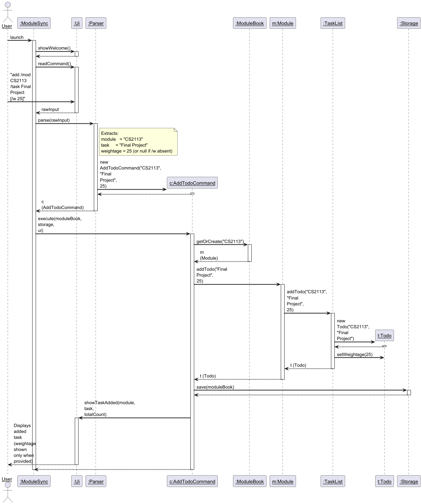

# Developer Guide

## Acknowledgements

{list here sources of all reused/adapted ideas, code, documentation, and third-party libraries -- include links to the original source as well}

## Design & implementation

//@@author Huang-Hau-Shuan
### [Feature] Task Weightage (`add ... [/w PERCENT]`)

#### Implementation

The Task Weightage feature allows students to assign a percentage value to a task, helping them
prioritize assignments based on their contribution to the overall module grade. Since not all tasks
have weightage, this feature supports both weighted and unweighted task creation in the existing
`add` command flow and the core `Task` model.

The feature implements the following operations:

* `Parser#parse(String)` — Parses the user input to identify the `add` command and extracts the
  optional `/w` argument when present, converting it to a validated integer.
* `AddTodoCommand#execute(ModuleBook, Storage, Ui)` — Executes the creation of a new task. It
  creates a `Todo` with optional weightage and adds it to the target module's `TaskList`.
* `Task#setWeightage(int)` and `Task#getWeightage()` — Methods inside the core `Task` model to
  store and retrieve the weightage value when it is provided.

Given below are example usage scenarios and how the task weightage mechanism behaves.

**Step 1.** The user inputs either:
- `add /mod CS2113 /task Final Project /w 25` (weightage provided), or
- `add /mod CS2113 /task Final Project` (weightage omitted).

**Step 2.** `ModuleSync#run()` calls `Ui#readCommand()`, which reads the raw input string from stdin
and returns it.

**Step 3.** `ModuleSync#run()` passes the raw string to `Parser#parse(...)`. The parser extracts the
module code and task description. If `/w` is present, it parses and validates the integer range
(`0` to `100`) via the `parseWeightage` helper. If `/w` is absent, weightage is recorded as `null`.

**Step 4.** The `Parser` instantiates a new `AddTodoCommand` with the module code, description, and
optional weightage, then returns it to `ModuleSync#run()`.

**Step 5.** `ModuleSync#run()` calls `AddTodoCommand#execute(moduleBook, storage, ui)`.

**Step 6.** Inside `execute()`, the command retrieves the target `Module` from the `ModuleBook` by
calling `ModuleBook#getOrCreate("CS2113")`.

**Step 7.** The command calls `Module#addTodo(description, weightage)`, which delegates to
`TaskList#addTodo(moduleCode, description, weightage)`. The `TaskList` creates the `Todo` object
and calls `Todo#setWeightage(int)` only when a weightage value is present.

**Step 8.** `Storage#save(ModuleBook)` is called to persist the change to disk.

**Step 9.** Finally, `Ui#showTaskAdded(module, task, totalCount)` is called to display the newly
added task. Weightage is shown only when provided.

#### Sequence Diagram

The following sequence diagram illustrates the interactions between components when the user
executes `add /mod CS2113 /task Final Project [/w 25]`:

> **Note:** The diagram above must be generated from
> [`docs/diagrams/AddWeightageSequenceDiagram.puml`](diagrams/AddWeightageSequenceDiagram.puml)
> and saved as `docs/images/AddWeightageSequenceDiagram.png`.

#### Design Considerations

**Aspect: How to store the weightage value**

* **Alternative 1 (Current choice): Store weightage as an `int` (0-100).**
    * Pros: Simple to parse, validate, and store. Eliminates floating-point precision issues when
      summing weightages across a module.
    * Cons: Does not support fractional weightages (e.g., `12.5%`), which some university modules
      use for smaller assessments.

* **Alternative 2: Store weightage as a `double`.**
    * Pros: Supports precise fractional weightages.
    * Cons: Adds complexity in input parsing and UI formatting to avoid displaying unwanted trailing
      zeros. Rounding errors may arise when summing many fractional values.

We chose `int` for v2.0 to maintain a streamlined, predictable CLI experience while keeping
validation straightforward.

**Aspect: Where to enforce the 0-100 validation**

* **Alternative 1 (Current choice): Validate in `Parser` when `/w` is present.**
    * Pros: Fails fast at the logic boundary; command objects are created with either a valid
      percentage or no percentage.
    * Cons: Validation rules must remain synchronized with command/model expectations.

* **Alternative 2: Validate inside `AddTodoCommand#execute()`.**
    * Pros: Validation lives close to where the value is used.
    * Cons: The `Command` layer would then need to handle user-facing error messages, blurring the
      separation of concerns between parsing and execution.

//@@author heeelol
### [Feature] List Upcoming Deadlines (`list /deadlines`)

#### Implementation

The List Deadlines feature provides a specialized view that displays only tasks with deadlines,
sorted chronologically from earliest to latest. This helps users plan their week by seeing
upcoming deadlines at a glance. The feature filters out to-do tasks without deadlines and
presents the filtered list in priority order.

The feature implements the following operations:

* `Parser#parseList(String)` — Parses the `list` command and checks for optional filters. When
  `/deadlines` is detected, it returns a `ListDeadlinesCommand` instead of the regular `ListCommand`.
* `ListDeadlinesCommand#execute(ModuleBook, Storage, Ui)` — Executes the deadline listing by
  calling `Ui#showDeadlineList()`.
* `Ui#showDeadlineList(ModuleBook)` — Collects all `Deadline` objects from all modules, sorts them
  by due date in ascending order (earliest first), and displays them in a user-friendly format.

Given below is the workflow for the List Deadlines feature:

**Step 1.** The user inputs `list /deadlines`.

**Step 2.** `ModuleSync#run()` calls `Ui#readCommand()`, which reads the raw input string from stdin.

**Step 3.** `ModuleSync#run()` passes the raw string to `Parser#parse(...)`. The parser detects the
`list` keyword and delegates to `Parser#parseList()`.

**Step 4.** `Parser#parseList()` checks if the input contains `/deadlines`. If found, it instantiates
a `ListDeadlinesCommand` and returns it; otherwise, it returns the regular `ListCommand`.

**Step 5.** `ModuleSync#run()` calls `ListDeadlinesCommand#execute(moduleBook, storage, ui)`.

**Step 6.** `execute()` delegates to `Ui#showDeadlineList(moduleBook)`.

**Step 7.** `showDeadlineList()` iterates through all modules in the `ModuleBook` and collects all
`Deadline` objects. For each deadline, it records the task number and module code.

**Step 8.** The collected deadlines are sorted by their `LocalDateTime by` field in ascending order
(earliest deadline first).

**Step 9.** Finally, the sorted deadlines are displayed to the user, showing module code, status,
description, due date/time, and days remaining.

#### Design Considerations

**Aspect: Filtering vs. separate command**

* **Alternative 1 (Current choice): Use optional filter syntax `list /deadlines`.**
    * Pros: Consistent with existing command structure. Can extend with more filters in future
      (e.g., `list /todos`). Reduces command namespace pollution.
    * Cons: Slightly more parsing logic in `Parser#parseList()`.

* **Alternative 2: Create a separate command `deadlines` or `view-deadlines`.**
    * Pros: Simpler parsing; no need to check for filters.
    * Cons: Increases command count; less extensible for future filters.

We chose the filter approach for consistency and extensibility.

**Aspect: Sorting order for deadlines**

* **Alternative 1 (Current choice): Sort by due date in ascending order (earliest first).**
    * Pros: Users see the most urgent deadlines first, aiding prioritization.
    * Cons: Does not highlight deadlines by urgency category (e.g., overdue vs. due soon vs. due later).

* **Alternative 2: Sort by days remaining with urgency grouping (overdue, due this week, etc.).**
    * Pros: Provides visual urgency categorization.
    * Cons: Adds complexity to sorting logic and UI formatting.

We chose ascending date order for simplicity and intuitive urgency ranking.

## Product scope
### Target user profile

{Describe the target user profile}

### Value proposition

{Describe the value proposition: what problem does it solve?}

## User Stories

|Version| As a ... | I want to ... | So that I can ...|
|--------|----------|---------------|------------------|
|v1.0|new user|see usage instructions|refer to them when I forget how to use the application|
|v2.0|user|find a to-do item by name|locate a to-do without having to go through the entire list|

## Non-Functional Requirements

{Give non-functional requirements}

## Glossary

* *glossary item* - Definition

## Instructions for manual testing

{Give instructions on how to do a manual product testing e.g., how to load sample data to be used for testing}
